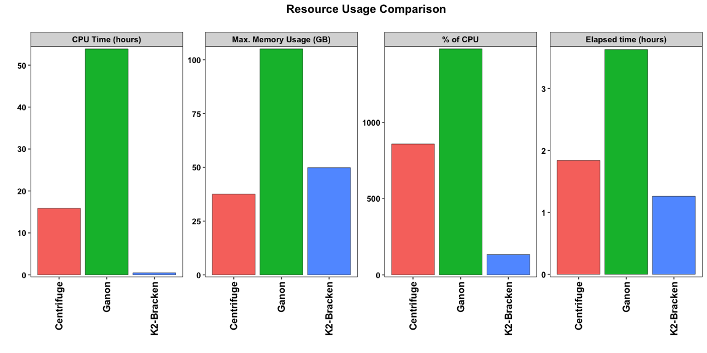

<br>

#### Load required libraries


```r
library(dplyr); packageVersion("dplyr")
```

```
## [1] '0.8.5'
```

```r
library(vegan); packageVersion("vegan")
```

```
## [1] '2.5.6'
```

```r
library(RColorBrewer); packageVersion("RColorBrewer")
```

```
## [1] '1.1.2'
```

```r
library(ggplot2); packageVersion("ggplot2")
```

```
## [1] '3.3.0'
```

```r
library(readxl); packageVersion("readxl")
```

```
## [1] '1.3.1'
```

```r
library(ggpubr); packageVersion("ggpubr")
```

```
## [1] '0.3.0'
```

```r
library(knitr);packageVersion("knitr")
```

```
## [1] '1.28'
```

<br>

#### Load custom functions


```r
# Custom function for melting bc distances
melt.dist <- function(x,only_identity = FALSE,omit_identity=TRUE) {
  library(reshape2)
  if(!is.matrix(x)) {
    x <- as.matrix(x)
  }
  y <- melt(x)
  if(omit_identity) {
    l <- list();
    nr <- nrow(x);
    nin <- c();
    for(i in 0:(nr - 1)){
      rs <- (i * nr)+1;
      if(only_identity==FALSE) {
        l[[i+1]] <- (rs+i):(rs+nr-1)
      } else {
        l[[i+1]] <- (rs+i)
      }
    }
    l <- -c(unlist(l))
    y <- y[l,]
  }
  return(y)
}

# Custom function for importing report files (3 arguments, file names, how many characters to keep, include header or not)
my_read_txt <- function(x, n, h) {
  out <- read.delim(x, sep = "\t", quote = "", stringsAsFactors = FALSE, header = h)
  sample <- substr(basename(x), 1, n) # basename removes directory, and substr selects 1:7 characters here
  cbind(sample=sample, out) # adding sample name as a column
}
```

<br>
<br>

### Input Zymo mmc data


```r
zymo_mmc_levels <- read.delim("zymo_mmc_logII.txt", sep = "\t", quote = "", stringsAsFactors = FALSE)
zymo_pct <- zymo_mmc_levels
colnames(zymo_pct) <- c("Var1", "Var2", "value") # For combining with others down the line
```

<br>

### Input sample metadata


```r
meta <- read_excel("pipeline_comp_meta.xlsx")
sample_desc <- read_excel("sample_desc.xlsx")
kable(sample_desc, caption = "Sample Details")
```


Table: Sample Details

name      desc                       trimmed_reads
--------  ------------------------  --------------
sample1   Zymo_mmc_05_1_undil              4283096
sample2   Zymo_mmc_05_2_undil              4327888
sample3   Zymo_mmc_05_1_undilcopy          4283096
sample4   Zymo_mmc_06_1_diluted            5270348
sample5   ML_even_hiseq_sim                4998731
sample6   ML_even_perfect_sim              4998731
sample7   ML_uneven_hiseq_sim              4998734
sample8   ML_uneven_perfect_sim            4998734

<br>

#### **We have 4 samples which are from Zymo Model Microbial Communities (MMC)**. 
**Sample 1** and **Sample 2** are 2 unique such samples. They are a known mix of 10 species of bacteria and fungi. So, for these samples we know what exact species to expect. 
**Sample 3** is a technical replicate of sample 1, we wanted to see how well the software performs with 2 exact replicas. 
**Sample 4** is also a MMC sample, but it has been diluted with water, which introduces some contaminants in it, so we expect to find more than just the 10 listed species there.

<br>

#### **Sample 5-8** are **Synthetic Metagenomes**. 
These samples were artifically created by cutting genomes into pieces computationally. We know exactly what species, and how much of each, are present. 
Samples 5 & 6 have an even distribution of the constituent species. 
Samples 7 and 8 have a staggard distribution. 
Samples 6 & 8 are "perfect" samples, while 5 & 7 are made to replicate how sequencing errors might look like.

<br>
<br>

## Read synthetic metagenome sample (sample 5:8) original data


```r
# Input synthetic reads
syn.tax <- read.delim("target-genome-info.tsv", sep = "\t", quote = "", stringsAsFactors = FALSE)

# List all files in the bracken_out directory
syn_files <- list.files(path="synthetic_samples", pattern="*.tsv", full.names=TRUE)

# Load tables & clean columns
syn.m <- bind_rows(lapply(syn_files, my_read_txt, 8, FALSE)) # apply the custom txt reading function to each file, and bind the list by row
colnames(syn.m) <- c("sample", "accession", "pct")
syn.m$accession <- gsub(".fa", "", syn.m$accession)
syn.m$accession <- gsub("-trimmed", "", syn.m$accession)
syn.m$species <- syn.tax$specific_name[match(syn.m$accession, syn.tax$accession)]

# Make species counts table for Kraken2 
syn_pct <- dcast(syn.m, sample ~ species, sum, value.var = "pct")
row.names(syn_pct) <- syn_pct$sample
syn_pct$sample <- NULL
syn_pct[is.na(syn_pct)] <- 0
# dim(syn_pct) # 4 48

# Order by abundance
syn_pct <- syn_pct[, order(colMeans(syn_pct), decreasing = T)]

# Display table
kable(syn_pct[, c(1:6)])
```

            Alcaligenes faecalis   Mandrillus leucophaeus   Mesorhizobium australicum   Sphingobacterium sp. 1.A.4   Staphylococcus epidermidis   Ralstonia mannitolilytica
---------  ---------------------  -----------------------  --------------------------  ---------------------------  ---------------------------  --------------------------
even_err               0.0333333                0.0166667                   0.0166667                    0.0166667                    0.0333333                   0.0333333
even_per               0.0333333                0.0166667                   0.0166667                    0.0166667                    0.0333333                   0.0333333
stag_err               0.0592251                0.0711611                   0.0691178                    0.0663078                    0.0434145                   0.0408736
stag_per               0.0592251                0.0711611                   0.0691178                    0.0663078                    0.0434145                   0.0408736

<br>
<br>

## Import Bracken (& Kraken2) results


```r
# Inpput Kracken2/Bracken results

# List all files in the bracken_out directory
brep_files <- list.files(path="bracken_out", pattern="*.txt", full.names=TRUE) 
brep.m <- bind_rows(lapply(brep_files, my_read_txt, 7, TRUE)) # apply the custom txt reading function to each file, and bind the list by row

# Make species counts table for Bracken estimates
brep_counts <- dcast(brep.m, sample ~ name, sum, value.var = "new_est_reads")
row.names(brep_counts) <- brep_counts$sample
brep_counts$sample <- NULL
brep_counts[is.na(brep_counts)] <- 0
row.names(brep_counts) <- paste0(row.names(brep_counts), "_br")
dim(brep_counts) # 8 5366
```

```
## [1]    8 5366
```

```r
# Convert to Relative Abundance
brep_pct <- decostand(brep_counts, method = "total")

# Order by abundance
brep_pct <- brep_pct[, order(colMeans(brep_pct), decreasing = T)]

# Check data
kable(brep_pct[, c(1:6)])
```

              Homo sapiens   Lactobacillus fermentum   Salmonella enterica   Escherichia coli   Pseudomonas aeruginosa   Listeria monocytogenes
-----------  -------------  ------------------------  --------------------  -----------------  -----------------------  -----------------------
sample1_br       0.0722376                 0.1643045             0.1354720          0.1187102                0.0623060                0.1010660
sample2_br       0.0182907                 0.1760192             0.1529426          0.1389259                0.0699399                0.1071486
sample3_br       0.0722376                 0.1643045             0.1354720          0.1187102                0.0623060                0.1010660
sample4_br       0.0604164                 0.1232946             0.1344693          0.1045271                0.0616600                0.0872228
sample5_br       0.1191714                 0.0000003             0.0000389          0.0000950                0.0652800                0.0000044
sample6_br       0.1190907                 0.0000000             0.0000227          0.0000901                0.0675425                0.0000047
sample7_br       0.1685095                 0.0000003             0.0000346          0.0000517                0.0153391                0.0000037
sample8_br       0.1677246                 0.0000000             0.0000187          0.0000540                0.0168036                0.0000029


<br>
<br>

## Import Ganon results


```r
# List all files in the bracken_out directory
gan_files <- list.files(path="ganon_out", pattern="*.txt", full.names=TRUE)
gan_files
```

```
## [1] "ganon_out/sample1_ganon_species.txt" "ganon_out/sample2_ganon_species.txt" "ganon_out/sample3_ganon_species.txt" "ganon_out/sample4_ganon_species.txt"
## [5] "ganon_out/sample5_ganon_species.txt" "ganon_out/sample6_ganon_species.txt" "ganon_out/sample7_ganon_species.txt" "ganon_out/sample8_ganon_species.txt"
```

```r
# Read all files and add sample name column 
gan.m <- bind_rows(lapply(gan_files, my_read_txt, 7, FALSE)) # apply the custom txt reading function to each file, and bind the list by row
colnames(gan.m) <- c("sample", "rank", "target", "taxid_lineage", "target_scientific_name", "unique_assignments", "reads_assigned", 
                     "cumulative_assignments", "cumulative_assignments_percent")
gan.m <- gan.m[gan.m$rank == "species", c(1:6)]
gan.m$unique_assignments <- as.numeric(gan.m$unique_assignments)

# Make species counts table for Bracken estimates
gan_counts <- dcast(gan.m, sample ~ target_scientific_name, sum, value.var = "unique_assignments")
row.names(gan_counts) <- gan_counts$sample
gan_counts$sample <- NULL
gan_counts[is.na(gan_counts)] <- 0
row.names(gan_counts) <- paste0(row.names(gan_counts), "_gan")
dim(gan_counts) # 8 3450
```

```
## [1]    8 3450
```

```r
# Convert to Relative Abundance
gan_pct <- decostand(gan_counts, method = "total")

# Order by abundance
gan_pct <- gan_pct[, order(colMeans(gan_pct), decreasing = T)]

# Check data
kable(gan_pct[, c(1:6)])
```

               Lactobacillus fermentum   Listeria monocytogenes   Salmonella enterica   Enterococcus faecalis   Alcaligenes faecalis   Moraxella osloensis
------------  ------------------------  -----------------------  --------------------  ----------------------  ---------------------  --------------------
sample1_gan                  0.2881820                0.1743708             0.1580712               0.1140167              0.0002860             0.0000221
sample2_gan                  0.2856433                0.1708909             0.1693516               0.1051977              0.0003631             0.0001242
sample3_gan                  0.2881820                0.1743708             0.1580712               0.1140167              0.0002860             0.0000221
sample4_gan                  0.2259734                0.1576569             0.1609495               0.0971979              0.0005950             0.0000757
sample5_gan                  0.0000000                0.0000004             0.0000065               0.0000000              0.0690810             0.1055499
sample6_gan                  0.0000000                0.0000000             0.0000078               0.0000000              0.0691389             0.1056169
sample7_gan                  0.0000000                0.0000000             0.0000112               0.0000004              0.1194713             0.0675964
sample8_gan                  0.0000000                0.0000000             0.0000151               0.0000000              0.1195075             0.0676703


<br>
<br>

## Import Centrifuge results


```r
# List all files in the directory
cent_files <- list.files(path="cent_out", pattern="*.txt", full.names=TRUE)
cent_files
```

```
## [1] "cent_out/sample1_centrifuge_reformatted_out.txt" "cent_out/sample2_centrifuge_reformatted_out.txt" "cent_out/sample3_centrifuge_reformatted_out.txt"
## [4] "cent_out/sample4_centrifuge_reformatted_out.txt" "cent_out/sample5_centrifuge_reformatted_out.txt" "cent_out/sample6_centrifuge_reformatted_out.txt"
## [7] "cent_out/sample7_centrifuge_reformatted_out.txt" "cent_out/sample8_centrifuge_reformatted_out.txt"
```

```r
# Read all files and add sample name column 
cent.m <- bind_rows(lapply(cent_files, my_read_txt, 7, FALSE)) # apply the custom txt reading function to each file, and bind the list by row
colnames(cent.m) <- c("sample", "percent_frag", "numb_frag_clade", "numb_frag_taxon", "tax_rank", "taxid", "name")
cent.m$name <- trimws(cent.m$name) # Remove leading whitespaces

# Subset for species ranks
cent.m <- cent.m[cent.m$tax_rank == "S",]
cent.m$numb_frag_taxon <- as.numeric(cent.m$numb_frag_taxon)

# Make species counts table for Bracken estimates
cent_counts <- dcast(cent.m, sample ~ name, sum, value.var = "numb_frag_taxon")
row.names(cent_counts) <- cent_counts$sample
cent_counts$sample <- NULL
cent_counts[is.na(cent_counts)] <- 0
row.names(cent_counts) <- paste0(row.names(cent_counts), "_cent")
dim(cent_counts) # 8 6119
```

```
## [1]    8 6119
```

```r
# Convert to Relative Abundance
cent_pct <- decostand(cent_counts, method = "total")

# Order by abundance
cent_pct <- cent_pct[, order(colMeans(cent_pct), decreasing = T)]

# Check data
kable(cent_pct[, c(1:6)])
```

                Homo sapiens   Lactobacillus fermentum   Listeria monocytogenes   Salmonella enterica   Enterococcus faecalis   Alcaligenes faecalis
-------------  -------------  ------------------------  -----------------------  --------------------  ----------------------  ---------------------
sample1_cent       0.1224718                 0.2622438                0.1608562             0.1163070               0.1052551              0.0003150
sample2_cent       0.0344582                 0.2962357                0.1789922             0.1405057               0.1105359              0.0004731
sample3_cent       0.1224718                 0.2622438                0.1608562             0.1163070               0.1052551              0.0003150
sample4_cent       0.1030041                 0.1931445                0.1366424             0.1097844               0.0842205              0.0007813
sample5_cent       0.1531038                 0.0000126                0.0000126             0.0000345               0.0000053              0.0533062
sample6_cent       0.1534780                 0.0000103                0.0000134             0.0000404               0.0000073              0.0535282
sample7_cent       0.2284607                 0.0000121                0.0000089             0.0000339               0.0000089              0.0993442
sample8_cent       0.2280644                 0.0000115                0.0000065             0.0000348               0.0000111              0.0995740

<br>
<br>

### Combine relative abundance data from all samples for comparison


```r
# Melt & Combine for comp
all_samples_comp.m <- rbind(melt(as.matrix(syn_pct)), melt(as.matrix(brep_pct)), melt(as.matrix(gan_pct)), melt(as.matrix(cent_pct)), zymo_pct)
colnames(all_samples_comp.m) <- c("sample", "species", "relabs")
unique(all_samples_comp.m$sample) # 37
```

```
##  [1] even_err     even_per     stag_err     stag_per     sample1_br   sample2_br   sample3_br   sample4_br   sample5_br   sample6_br   sample7_br   sample8_br  
## [13] sample1_gan  sample2_gan  sample3_gan  sample4_gan  sample5_gan  sample6_gan  sample7_gan  sample8_gan  sample1_cent sample2_cent sample3_cent sample4_cent
## [25] sample5_cent sample6_cent sample7_cent sample8_cent zymo_mmc    
## 29 Levels: even_err even_per stag_err stag_per sample1_br sample2_br sample3_br sample4_br sample5_br sample6_br sample7_br sample8_br ... zymo_mmc
```

<br>
<br>

## Distance Based Analysis
<br>
Using Bray-Curtis Dissimilarities to quantify difference in microbial composition among samples (Beta Diversity measure)

```r
# Make species counts table for Bracken estimates
all_samples_comp_pct <- dcast(all_samples_comp.m, sample ~ species, sum, value.var = "relabs")
row.names(all_samples_comp_pct) <- all_samples_comp_pct$sample
all_samples_comp_pct$sample <- NULL
all_samples_comp_pct[is.na(all_samples_comp_pct)] <- 0
dim(all_samples_comp_pct) # 37 6779
```

```
## [1]   29 6779
```

```r
# Calculate distance
all_samples.dist <- vegdist(all_samples_comp_pct, method = "bray")
all_samples.dist.m <- melt.dist(all_samples.dist)
colnames(all_samples.dist.m) <- c("samp1", "samp2", "dist")

# Add sample info
all_samples.dist.m$s1 <- meta$sample[match(all_samples.dist.m$samp1, meta$name)]
all_samples.dist.m$s2 <- meta$sample[match(all_samples.dist.m$samp2, meta$name)]

# Subset for same samples
same_samp_dist <- all_samples.dist.m[all_samples.dist.m$s1 == all_samples.dist.m$s2, ]

# Add type
same_samp_dist$type1 <- meta$type[match(same_samp_dist$samp1, meta$name)]
same_samp_dist$type2 <- meta$type[match(same_samp_dist$samp2, meta$name)]

# Subset synth
same_samp_dist_synth <- same_samp_dist[same_samp_dist$type1 == "synthetic", ]
same_samp_dist_synth$syn_type <- sapply(strsplit(as.character(same_samp_dist_synth$samp1), "_"), `[`, 2)
same_samp_dist_synth$syn_type <- gsub("err", "HiSeq Error", same_samp_dist_synth$syn_type)
same_samp_dist_synth$syn_type <- gsub("per", "Perfect", same_samp_dist_synth$syn_type)

# Add even info
same_samp_dist_synth$even <- sapply(strsplit(as.character(same_samp_dist_synth$samp1), "_"), `[`, 1)

# Clean names
same_samp_dist_synth$even <- gsub("even", "Even Distribution", same_samp_dist_synth$even)
same_samp_dist_synth$even <- gsub("stag", "Staggered Distribution", same_samp_dist_synth$even)

# Set factor levels
same_samp_dist_synth$type2 <- factor(same_samp_dist_synth$type2, levels = c("Centrifuge", "Ganon", "K2-Bracken"))
```

<br>
<br>

#### Box plot of distances between expected and predicted microbial communities for Synthetic Metagenomes


```r
# Plot
set.seed(1234);ggplot(same_samp_dist_synth, aes(type2, dist)) + geom_boxplot(lwd=0.5) + scale_y_continuous(limits = c(0.48,0.72)) + 
  geom_jitter(aes(fill=even), height = 0, width = 0.2, alpha=0.6, pch=21, stroke=0.2, size =5) + 
  stat_compare_means(label.x.npc = 0.4, col="firebrick4") + 
  labs(fill="Syn. Metagenome Type", x="", y="Bray-Curtis Dissimilarities\n", title = "Accuracy Comparison: Synthetic Metagenomes\n") + 
  theme_classic() + theme(axis.text.x = element_text(size=12, face="bold", color = "black"), legend.position = "right", panel.grid = element_blank(),
                          axis.text.y = element_text(size=10, face="bold", color = "black"), plot.title = element_text(size=14, face="bold", hjust = 0.5),
                          axis.title = element_text(size=14, color="black", face="bold"), legend.key.size =unit(0.2,"cm"))
```

<!-- -->

```r
ggsave(file="pipeline_accuracy_comp.pdf", width = 8, height = 6, units = "in")
```

<br>
<br>

## Compare the 4 MMC Samples


```r
# Sample 1, 2 and 3 are zymo MMC undiluted. 3 is replicate of 1.
sample1234_pct <- all_samples_comp_pct[row.names(all_samples_comp_pct) %in% meta$name[meta$sample %in% c(1:4)], ]
sample1234_pct <- sample1234_pct[, colSums(sample1234_pct) > 0]

# Order species by abundance
sample1234_pct <- sample1234_pct[, order(colMeans(sample1234_pct), decreasing = T)]

# Zymo sp only
sample1234_pct_zym <- sample1234_pct[, colnames(sample1234_pct) %in% zymo_mmc_levels$species]
sample1234_pct_zym$Others <- rowSums(sample1234_pct[, !(colnames(sample1234_pct) %in% zymo_mmc_levels$species)])

# Melt
sample1234_pct_zym.m <- melt(as.matrix(sample1234_pct_zym))
colnames(sample1234_pct_zym.m) <- c("name", "species", "pct")
sample1234_pct_zym.m$pct <- sample1234_pct_zym.m$pct*100

# Add sample info
sample1234_pct_zym.m$sample <- meta$sample[match(sample1234_pct_zym.m$name, meta$name)]

# Add type info
sample1234_pct_zym.m$type <- meta$type[match(sample1234_pct_zym.m$name, meta$name)]

# Add sample details
sample1_4_desc <- read_excel("sample1_4_desc.xlsx")
sample1234_pct_zym.m$desc <- sample1_4_desc$details[match(sample1234_pct_zym.m$sample, sample1_4_desc$sample)]

# For labels
sample1234_pct_zym.m_oth <- sample1234_pct_zym.m[sample1234_pct_zym.m$species == "Others", ]
```

<br>
<br>

#### Bar Plot of relative abundances of the MMC samples


```r
# Set colors
posctrl_colors = colorRampPalette(brewer.pal(12, "Paired"))

# Extraction Ctrl Barplot of rel abundance
ggplot(sample1234_pct_zym.m, aes(type, pct)) + facet_grid(~desc, scales="free_x", space="free_x") +
  geom_bar(stat="identity", aes(fill=species), lwd=0.1, width = 0.8, color="black") + 
  scale_fill_manual(values=c(posctrl_colors(ncol(sample1234_pct_zym)-1), "grey50")) + 
  labs(x="", y ="Relative Abundance%\n", fill="", title = "Taxonomic Comparison: MMC Samples\n") + 
  scale_y_continuous(expand=c(0,1)) + guides(fill=guide_legend(ncol=1)) + theme_bw() +
  #annotate("text", )
  geom_text(data=sample1234_pct_zym.m_oth, aes(label=paste0(round(pct,1), "%"), y=2), size=3, color="white") +
  theme(axis.text.x = element_text(size=12, face="bold", color = "black", angle=90, hjust = 1, vjust=0.5), legend.position = "right", panel.grid = element_blank(),
        legend.text = element_text(face="italic"), axis.text.y = element_text(size=10, face="bold", color = "black"), 
        plot.title = element_text(size=14, face="bold", hjust = 0.5), panel.spacing = unit(1, "lines"), legend.key.size =unit(0.6,"cm"), 
        axis.title = element_text(size=14, color="black", face="bold"))
```


```r
ggsave(file="sample1234_relabs_sp_zym.pdf", width = 12, height = 6, units = "in")
```

<br>
<br>

## Resource Usage


```r
resource_comp <- read_excel("resource_comp.xlsx")
resource_comp.m <- melt(resource_comp)
```

```
## Using Tool as id variables
```


```r
ggplot(resource_comp.m, aes(Tool, value)) + geom_bar(stat = "identity", position = "dodge", aes(fill=Tool), col="black", lwd=0.2) + 
  facet_wrap(~variable, scales="free_y") + labs(x="", y ="", fill="", title = "Resource Usage Comparison\n") + scale_y_continuous(expand=c(0.01,0.01)) + theme_bw() +
  theme(axis.text.x = element_text(size=12, face="bold", color = "black", angle=90, hjust = 1, vjust=0.5), legend.position = "Na", panel.grid = element_blank(),
        legend.text = element_text(face="italic"), axis.text.y = element_text(size=10, face="bold", color = "black"),
        strip.text = element_text(size=10, face="bold", color = "black"), plot.title = element_text(size=14, face="bold", hjust = 0.5),
        axis.title = element_text(size=14, color="black", face="bold"))
```



```r
ggsave(file="resource_use_comp.pdf", width = 12, height = 6, units = "in")
```


